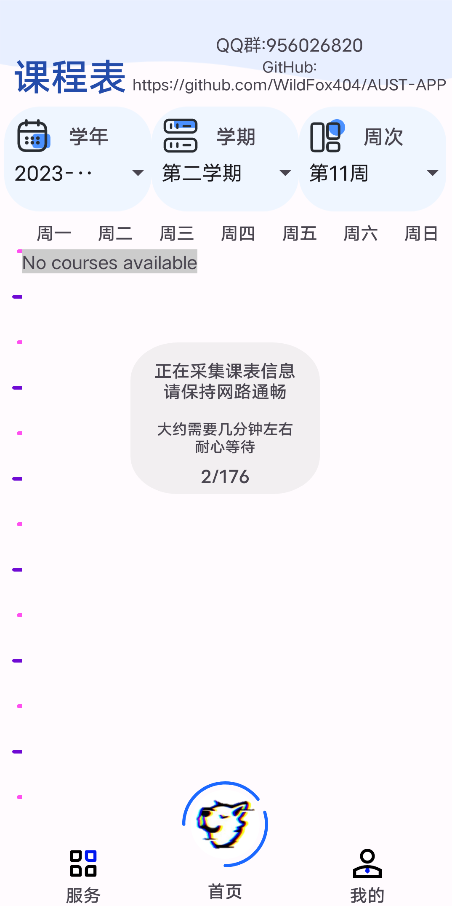
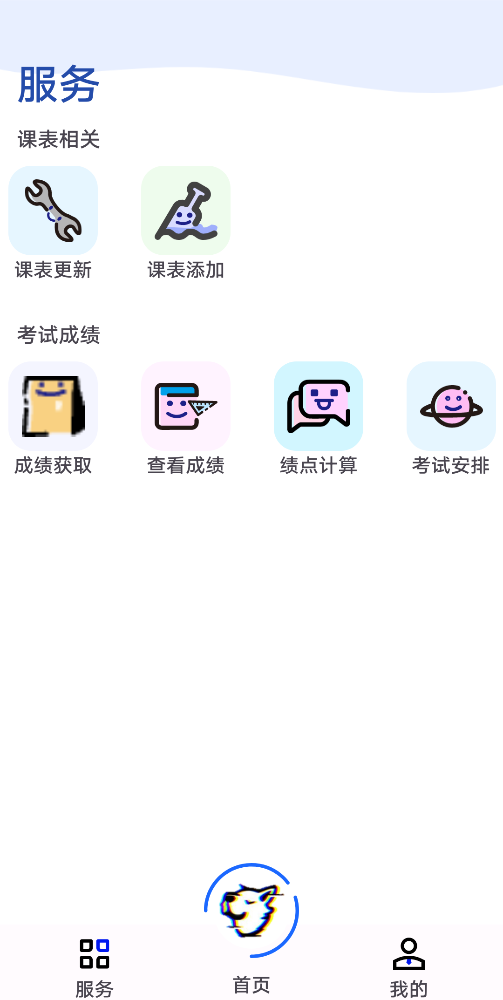
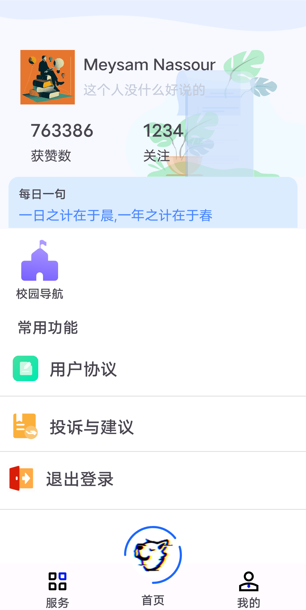

  
  
AUST Application (Available on Android)

# AUST-APP 
此软件在采集完数据后存储在本地 
之后使用无需链接校园网 
不过更新数据还是需要链接校园网 

# 使用 
1.链接校园网 
2.登录 
3.等待数据获取完成 
<table>
  <tr>
    <td>

</td>
  </tr>
</table>
4.选择学期和学年
<table>
  <tr>
    <td>

</td>
    <td>

</td>
    <td>

</td>
  </tr>
</table>

# TODO 
1.添加额外课程功能
2.充电桩,洗衣扫码(爬虫,有考试)
3.社交平台,发帖(将发布一个在线版本)
